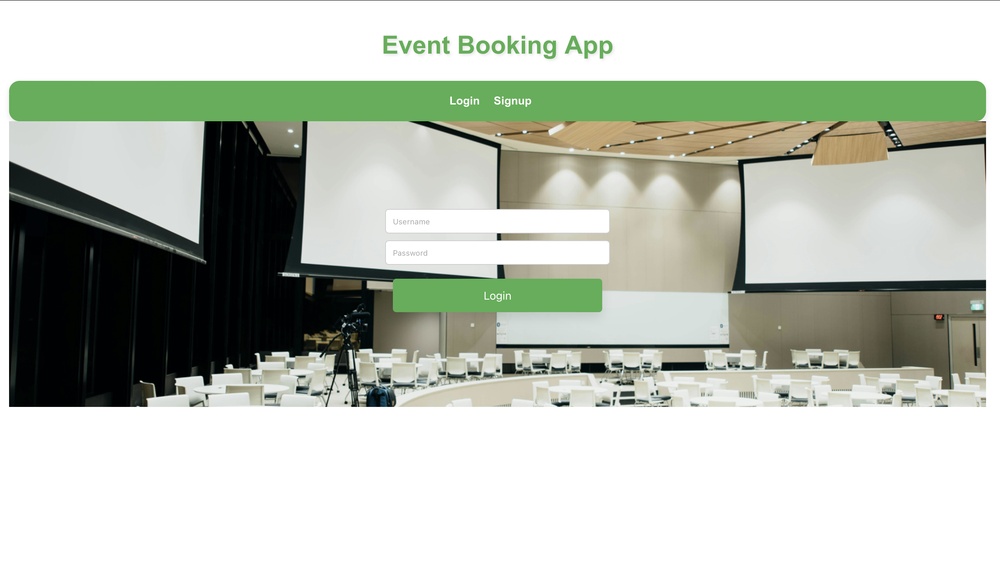

# MERN Fullstack Booking Application 🦕 - (MongoDB, Express.js, React.js and Node.js)

Booking app is a fullstack application for event booking and organize event.


## Table of Contents 📋

- [Installation](#installation)
- [Usage](#usage)
- [Features](#features)
- [Contributing](#contributing)
- [License](#license)
- [Contact](#contact)
- [Acknowledgements](#acknowledgements)

## Installation 💻

```sh
# Change directory respecitve backend and frontend directory and use below commands
npm i
npm i --save-dev

```

```sh
# Clone the repository
git clone https://github.com/msjadhav03/booking-app.git

# Navigate to the project directory
cd booking-app.git

# Install dependencies by moving in frontend and backend respectively
npm install

# Install Dev Dependencies
npm install --save-dev

```

## Usage

```sh

# Start
npm run start

```

## Features ✨

- ### Login Page

  

- ### General Dashboard

  

- ### Organizer Dashboard

  

- ### Event Listing

  

- ### Booking Event

  

## Contributing 🤝

Guidelines for contributing to the project. Include information about setting up a development environment and making pull requests.

### Fork the repository

- Create your feature branch (git checkout -b feature/your-feature)
- Commit your changes (git commit -am 'Add some feature')
- Push to the branch (git push origin feature/your-feature)
  Create a new Pull Request

## License 📄

This project is licensed under the [ISC License](https://opensource.org/licenses/ISC):

## Contact 📧

[Manisha Jadhav](https://github.com/m.s.jadhav03)
